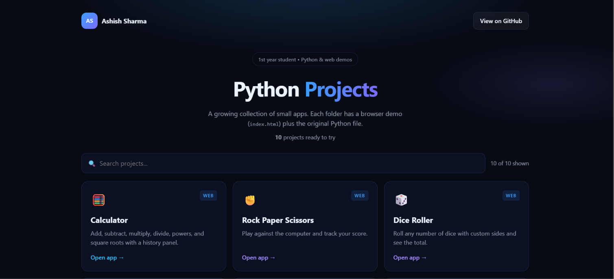

# Python Projects



A curated collection of small Python programs (CLI and Tkinter) with matching browser demos so anyone can learn and try the apps without installing anything. This repository is primarily a learning/portfolio collection — the Python code is the main content and the site is a lightweight GitHub Pages frontend.

Live demo: https://ashishsrs01.github.io/Python-projects/

---

## Highlights

- Small, self-contained projects (each project has a Python source and a browser demo `index.html`).
- Central hub (`index.html`) lists apps and links into each folder. The hub reads `apps.json`; a built-in fallback is used when `apps.json` is unavailable (e.g. `file://`).
- Frontend assets are intentionally kept separate and small — they are used only for the GitHub Pages frontend.

---

## Projects (quick reference)

Each project folder contains a Python source file and an `index.html` demo. See the hub or the table below for direct links.

| Project | Python source | Web demo |
|---|---:|:---|
| Calculator | `Calculator/Calculator.py` | `Calculator/index.html` |
| Rock Paper Scissors | `Rock paper scissor/Rock-paper-scissor-game.py` | `Rock paper scissor/index.html` |
| Dice Roller | `DIce roller/roller.py` | `DIce roller/index.html` |
| Countdown Timer | `Timer/Countdown Timer.py` | `Timer/index.html` |
| Word Frequency Counter | `Word frequency counter/counter.py` | `Word frequency counter/index.html` |
| Text to Speech | `Text to speech app/t-t-s.py` | `Text to speech app/index.html` |
| BG Remover | `BG remover/python-background-remover.py` | `BG remover/index.html` |
| Currency Converter | `currency converter/cc.py` | `currency converter/index.html` |
| Unit Converter | `Unit converter/uc.py` | `Unit converter/index.html` |
| Todo App | `Todo app/todo.py` | `Todo app/index.html` |
| Number Guessing Game | `Number gussing app/ng.py` | `Number gussing app/index.html` |

For details and usage examples open the folder for any project.

---

## Quick start

Clone the repository and try the hub locally:

```bash
git clone https://github.com/ashishsrs01/Python-projects.git
cd Python-projects

# Serve the repo over HTTP so the hub's fetch('apps.json') works properly
python3 -m http.server 8000
# then open http://localhost:8000/ in your browser
```

Open any project's `index.html` to try the web demo, or run the Python script directly (examples below).

### Run Python apps (examples)

```bash
python "Calculator/Calculator.py"
python "Timer/Countdown Timer.py"
python "DIce roller/roller.py"
python "Word frequency counter/counter.py"
```

**BG Remover** requires additional Python packages (see `requirements.txt`):

```bash
pip install -r requirements.txt
python "BG remover/python-background-remover.py"
```

---

## Adding a new app

1. Create a new folder for your project and add your Python file (e.g. `myapp.py`).
2. Add an `index.html` demo file that links back to the hub with a relative link.
3. Add a single entry to `apps.json` describing the app (see existing entries for examples).
4. Optionally include a small icon and tags in `apps.json` to surface the app in the hub.

See [ADD_APP.md](ADD_APP.md) for step-by-step instructions.

---

## GitHub Pages & language stats

- This repo uses GitHub Pages (via Actions) to publish the hub at the URL above.
- The repository is intentionally Python-focused. To make GitHub's language statistics reflect that, frontend files used only by the Pages frontend (HTML/CSS/JS) are listed in `.gitattributes` with `linguist-vendored` so Linguist excludes them from the language breakdown. This does not affect site behavior.

Note: marking files as `linguist-vendored` reduces their impact on the language graph but the final percentage shown on GitHub depends on every file's byte size and other non-Python files in the repo — it cannot be guaranteed to be exactly 99%.

---

## Contributing

Contributions are welcome. If you add a new app please:

1. Keep the project self-contained and document any extra dependencies.
2. Add an `index.html` demo (if applicable) and a link back to the hub.
3. Update `apps.json` with an entry for the new app.

Create a PR and describe what the app does and any special run instructions.

---

## License

This repository is provided for learning and personal use. If you'd like a formal license added, open an issue or PR and I will add one (MIT, Apache-2.0, etc.).

---

## About the Author

Built by Ashish Sharma as part of a Python learning journey.

The code is intentionally simple, practical, and easy to understand so it can be used for learning, practice, and portfolio building.

